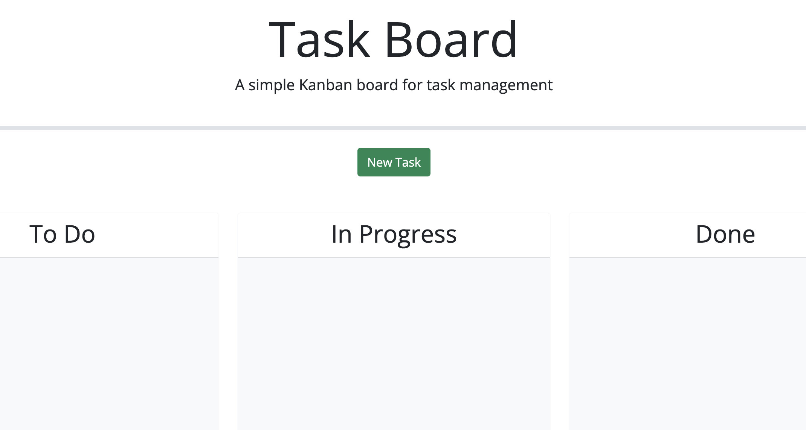
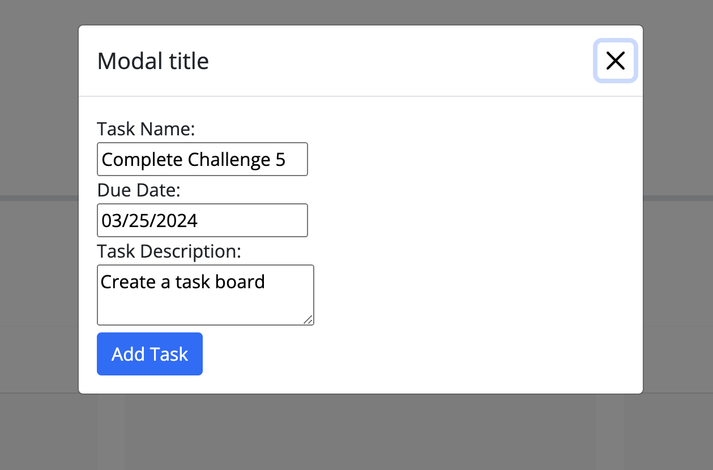
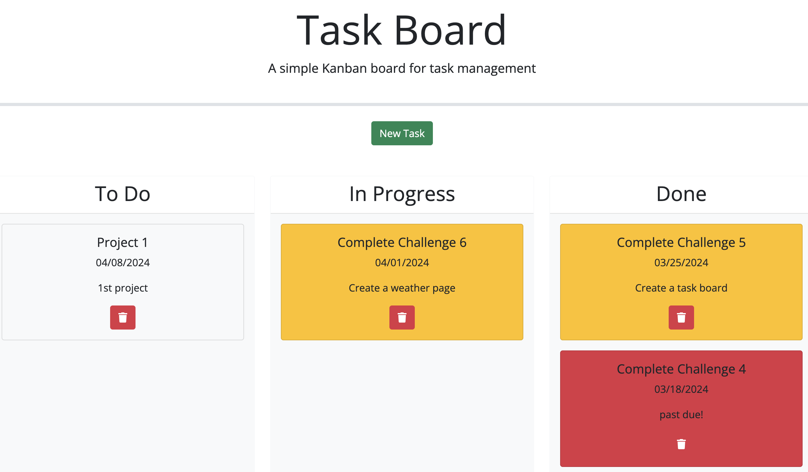

# 05-Challenge

## Description

In this challenge, I was 'tasked' (pun intended) with modifying a task board app so that it is functionable for the user.

I added a bootstrap modal with a form the users can fill out to create a task card. Each task card is dynamically displayed on the task board.

The tasks task cards are saved to local storage and can be dragged and dropped in each colomn to show the progress of the task.

I also used day.js to alter the colors of the task card to show inportance for the user and stress ergency on completing each task.

The tasks render on reload as long as the local storage is not cleared.

## Usage

Usage of this web app is clear and easy to navigate.

This is how the app looks on a fresh reload with no local storage data. You can see the 3 colloms of the task board as well as an Add Task button. To begin, click that button.

Once the modal pops up, you can enter the information in the fields and click add task.

Finally, you can see the task board with multiple tasks and each was dragged to the area on the task board relating to the specific task. 

## Credits

This app uses Bootstrap, jQuery, and Day.js. I used w3Schools as well as my CWRU curriculum guide.

## License

This app uses an MIT license